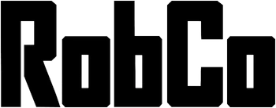

# RobCo Industries React Components

As a bit of fun I am attempting to recreate a bunch of the user interface components from the [RobCo Industries](https://fallout.fandom.com/wiki/RobCo_Industries) [Unified Operating System](https://fallout.fandom.com/wiki/Unified_Operating_System) used on Pip-Boys and Terminals from the Fallout game franchise as reusable react components - I am primarily doing this to suit my own needs when building my personal site so there is likely to be lots of room for improvement :)

## Installation

Use npm or yarn to install the library.

```bash
yarn add @nickpack/react-robco
```

## Usage

I am going to assume that you are familiar with react, and I probably won't document this very well.

When the library has some components in it, I will publish the storybooks, for now you can run them locally with:

```bash
yarn storybook
```

## Contributing

Pull requests are welcome. For major changes, please open an issue first
to discuss what you would like to change.

Please make sure to update tests as appropriate.

## License

[MIT](https://choosealicense.com/licenses/mit/)

## Author

Nick Pack <https://github.com/nickpack>
